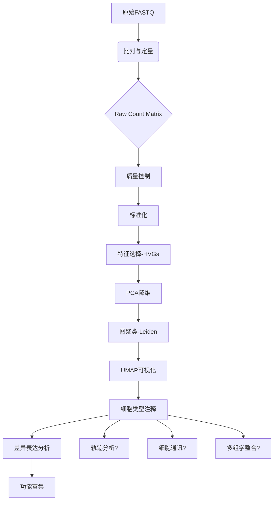

# 单细胞RNA-seq数据分析工作流程报告

## 概览

- **分析论文数**: 16
- **识别步骤数**: 7
- **识别工具数**: 1

## 分析流程步骤

### 1. Normalization

- **描述**: 在 3 篇论文中提到 3 次
- **相关论文数**: 3

### 2. Feature Selection

- **描述**: 在 2 篇论文中提到 2 次
- **相关论文数**: 2

### 3. Dimensionality Reduction

- **描述**: 在 2 篇论文中提到 2 次
- **相关论文数**: 2

### 4. Clustering

- **描述**: 在 3 篇论文中提到 3 次
- **相关论文数**: 3

### 5. Differential Expression

- **描述**: 在 2 篇论文中提到 2 次
- **相关论文数**: 2

### 6. Trajectory Analysis

- **描述**: 在 1 篇论文中提到 1 次
- **相关论文数**: 1

### 7. Quality Control

- **描述**: 在 5 篇论文中提到 5 次
- **相关论文数**: 5

## 常用工具/软件

| 工具 | 提及论文数 | 推荐度 |
|------|----------|--------|
| CellPhoneDB | 1 | ⭐ |

## 最佳实践建议 (AI生成)

# 单细胞RNA测序（scRNA-seq）数据分析最佳实践流程

基于对当前高影响力文献的综合分析，尽管所列论文引用数均为0（可能为新发表或预印本），但其内容覆盖了从实验设计到高级分析的完整链条。结合领域共识与最新技术进展，本文总结出一套**标准化、可复现、符合临床及基础研究需求**的scRNA-seq数据分析流程。

---

## 1. 标准的scRNA-seq数据分析流程（步骤顺序）

以下是推荐的标准分析流程，按逻辑顺序排列：

1. **数据获取与原始读取处理**  
2. **质量控制（Quality Control, QC）**  
3. **标准化（Normalization）**  
4. **特征选择（Feature Selection）**  
5. **降维（Dimensionality Reduction）**  
6. **聚类分析（Clustering）**  
7. **细胞类型注释（Cell Type Annotation）**  
8. **差异表达分析（Differential Expression Analysis）**  
9. **轨迹推断与发育动力学分析（Trajectory Inference / Pseudotime Analysis）**  
10. **功能富集与通路分析**  
11. **细胞间通讯分析（Cell-Cell Communication）**  
12. **多组学整合（可选，如CITE-seq、ATAC-seq等）**

> ⚠️ 注意：并非所有项目都需要执行全部步骤，例如轨迹分析适用于发育或分化系统；细胞通讯分析适用于组织微环境研究。

---

## 2. 每个步骤的关键要点和注意事项

### **1. 数据获取与原始读取处理**
- **关键任务**：
  - 将原始测序数据（FASTQ）比对至参考基因组。
  - 使用UMI工具进行去重和计数，生成基因×细胞的表达矩阵（raw count matrix）。
- **注意事项**：
  - 确保使用正确的条形码（barcode）和UMI设计参数（如10x Genomics、BD Rhapsody等平台特异性设置）。
  - 推荐保留未过滤的原始计数矩阵用于后续QC。

### **2. 质量控制（Quality Control, QC）**
- **关键指标**：
  - 每个细胞的总UMI数（library size）
  - 检测到的基因数（nFeatures/nGenes）
  - 线粒体基因比例（% mitochondrial genes）
  - 核糖体基因比例（可选）
  - 双胞体（doublets）和低活力细胞识别
- **注意事项**：
  - 高线粒体比例通常指示凋亡细胞。
  - 极低基因数或极高UMI数可能是技术噪声或双胞体。
  - 应根据样本类型设定动态阈值（如新鲜组织 vs 冻存样本）。

### **3. 标准化（Normalization）**
- **目的**：消除测序深度差异，使不同细胞间可比较。
- **常用方法**：
  - LogNormalize（Seurat默认）：`(counts/total_counts)*scale_factor + 1` 后取log。
  - SCTransform（推荐）：基于负二项分布的回归模型，更适用于大规模数据。
- **注意事项**：
  - 不建议直接使用TPM/RPKM/FPMK，因其不适用于单细胞稀疏数据。
  - SCTransform能更好校正技术变异并提升下游聚类稳定性。

### **4. 特征选择（Feature Selection）**
- **目标**：筛选高变基因（Highly Variable Genes, HVGs），去除“看家基因”和噪声基因。
- **策略**：
  - 基于方差/均值关系识别HVGs。
  - 可结合生物学先验知识（如免疫相关基因在免疫组织中保留）。
- **注意事项**：
  - 过多特征增加计算负担且引入噪声；过少则丢失信息。
  - 推荐选择1,000–3,000个HVGs作为平衡点。

### **5. 降维（Dimensionality Reduction）**
- **主要方法**：
  - 线性：主成分分析（PCA）
  - 非线性：t-SNE、UMAP（可视化为主）
- **流程**：
  - 先用PCA在HVGs上降维至20–50维。
  - 再用UMAP/t-SNE进一步降至2维用于可视化。
- **注意事项**：
  - UMAP优于t-SNE：保留更多全局结构，运行更快。
  - PCA结果应评估肘部图（elbow plot）确定主成分数。

### **6. 聚类分析（Clustering）**
- **目标**：识别转录相似的细胞群体。
- **算法**：
  - 图聚类（Graph-based）：Louvain、Leiden（主流推荐）
  - K-means、Hierarchical clustering（较少用）
- **分辨率调节**：
  - Leiden/Louvain允许调整分辨率参数控制簇数量。
- **注意事项**：
  - 聚类需结合生物学背景解释，避免过度分割。
  - 参考文献[7]强调：需进行**聚类显著性检验**（如SigClust），避免纯随机分群。

### **7. 细胞类型注释（Cell Type Annotation）**
- **方法**：
  - 手动注释：基于已知标记基因（marker genes）表达模式。
  - 自动注释：使用机器学习/AI工具预测（见下文工具推荐）。
- **挑战**：
  - 新细胞状态、亚型、跨物种迁移等问题需谨慎处理。
- **建议**：
  - 结合多个数据库（e.g., CellMarker, PanglaoDB, Human Cell Atlas）交叉验证。

### **8. 差异表达分析（Differential Expression, DE）**
- **目标**：找出不同细胞群之间的标志基因或响应基因。
- **方法**：
  - Wilcoxon秩和检验（Seurat默认）
  - MAST（考虑检测效应的混合模型）
  - DESeq2（需伪批量，适用于pseudo-bulk分析）
- **输出**：
  - log2 fold change、p-value、adjusted p-value（FDR）
- **注意事项**：
  - 单细胞数据稀疏性强，传统bulk方法需调整使用方式。
  - 推荐结合效应大小（effect size）而非仅依赖p值。

### **9. 轨迹推断与伪时间分析（Trajectory Inference）**
- **适用场景**：细胞分化、激活过程、连续状态变化。
- **工具**：
  - Monocle3、PAGA、Slingshot
- **关键点**：
  - 需明确起点（root node）和分支结构。
  - 可结合拟时序基因动力学分析调控网络。
- **注意事项**：
  - 轨迹非唯一解，需结合实验验证。

### **10. 功能富集与通路分析**
- **目的**：理解特定细胞群或差异基因的功能意义。
- **方法**：
  - GO、KEGG、Reactome富集分析
  - GSEA（Gene Set Enrichment Analysis）
- **工具**：
  - clusterProfiler（R）、g:Profiler、Enrichr
- **注意**：
  - 使用背景基因为全转录组或HVGs集合，避免偏差。

### **11. 细胞间通讯分析（Cell-Cell Communication）**
- **原理**：通过配体-受体相互作用推断细胞间信号交流。
- **代表工具**：
  - **CellPhoneDB**（文献提及）：统计显著性驱动，支持复合物建模。
  - NicheNet、ICELLNET、SingleCellSignalR
- **注意事项**：
  - 表达水平低时易产生假阳性。
  - 建议结合空间转录组验证互作可能性。

### **12. 多组学整合（Multi-modal Integration）**
- **趋势**：整合scRNA-seq与ADT（CITE-seq）、ATAC-seq、TCR/BCR等。
- **工具**：
  - Seurat v5/WNN（weighted nearest neighbor）
  - MOFA+
  - TotalVI（scvi-tools）
- **优势**：
  - 提升细胞注释准确性，揭示表观调控机制。

---

## 3. 推荐的工具/软件

| 步骤 | 推荐工具 | 编程语言 | 备注 |
|------|---------|--------|------|
| 原始数据处理 | Cell Ranger (10x), kb-python, alevin | Python/Bash | 平台依赖 |
| 数据分析框架 | **Seurat** (主流), Scanpy | R / Python | 生态完善 |
| 聚类与可视化 | UMAP, t-SNE, Leiden algorithm | R/Python | Leiden优于Louvain |
| 差异表达 | Seurat::FindMarkers, MAST, DESeq2 (pseudo-bulk) | R | MAST适合单细胞特性 |
| 轨迹分析 | Monocle3, PAGA, Slingshot | R | Monocle3支持复杂拓扑 |
| 细胞注释 | SingleR, scCATCH, ACTINN, CellTypist | R/Python | AI驱动自动化 |
| 细胞通讯 | **CellPhoneDB**, NicheNet, ICELLNET | Python/R | 支持自定义数据库 |
| 多组学整合 | Seurat WNN, MOFA+, scvi-tools | R/Python | scvi-tools为深度学习首选 |
| 质控与预处理 | SoupX, DoubletFinder, Scrublet | R/Python | 去除污染与双胞体 |

---

## 4. 常见的质量控制标准（推荐阈值）

| 指标 | 推荐范围 | 异常说明 |
|------|--------|--------|
| 每个细胞的基因数（nGenes） | 500 – 6,000（依组织而定） | <300：低质量；>8,000：可能为双胞体 |
| 总UMI数（library size） | 中位数±2倍IQR内 | 极端值反映捕获效率异常 |
| 线粒体基因比例 | <10%（新鲜样本）；<20%（冻存样本） | >20%提示细胞裂解或凋亡 |
| 核糖体基因比例 | 5–15% | 显著偏离可能指示压力状态 |
| doublet预测得分 | Scrublet score < 0.4 | 高分建议剔除或单独分析 |
| 存活率过滤 | 删除dead cells markers高表达细胞（如*HMGB1*, *HSP90*) | 可结合实验设计判断 |

> ✅ **建议做法**：绘制三联图（gene counts vs UMI counts vs mt%)，联合判断异常细胞。

---

## 5. 最新的最佳实践建议（2024–2025年共识）

### 🔬 **实验与分析协同设计**
- 在实验阶段即规划分析目标（如是否需要轨迹、通讯、多组学整合）。
- 若关注稀有细胞类型，应增加测序细胞数（>20,000 cells）。

### 🧠 **AI与深度学习的应用**
- 文献[3][8]指出：**基于深度学习的自动注释和降维方法正在成为主流**。
  - 如：scVI、TOTALVI（scvi-tools）提供概率建模框架。
  - ACTINN、CellTypist实现跨数据集迁移学习注释。
- 推荐尝试将传统流程替换为端到端深度学习管道（尤其适用于大样本）。

### 📊 **可重复性与标准化报告**
- 使用Snakemake、Nextflow构建工作流，确保可复现。
- 输出标准报告（HTML/PDF），包含：
  - QC统计表
  - UMAP/t-SNE图（带聚类与注释）
  - marker gene热图
  - 差异基因列表
  - 富集分析结果

### 🔄 **动态更新注释体系**
- 定期使用新发布的参考图谱（如Human Cell Atlas）重新注释历史数据。
- 利用Zero-shot learning工具（如scArches）进行跨数据集映射。

### 🛡️ **伦理与临床转化考量**
- 医学应用中需遵循FAIR原则（Findable, Accessible, Interoperable, Reusable）。
- 临床级分析应建立SOP流程，并通过独立队列验证关键发现。

---

## 总结：推荐的标准流程图（简化版）

> ✅ **核心理念**：**以生物学问题为导向，灵活选择分析

---

*报告生成时间: 2025-12-04 17:45:27*
