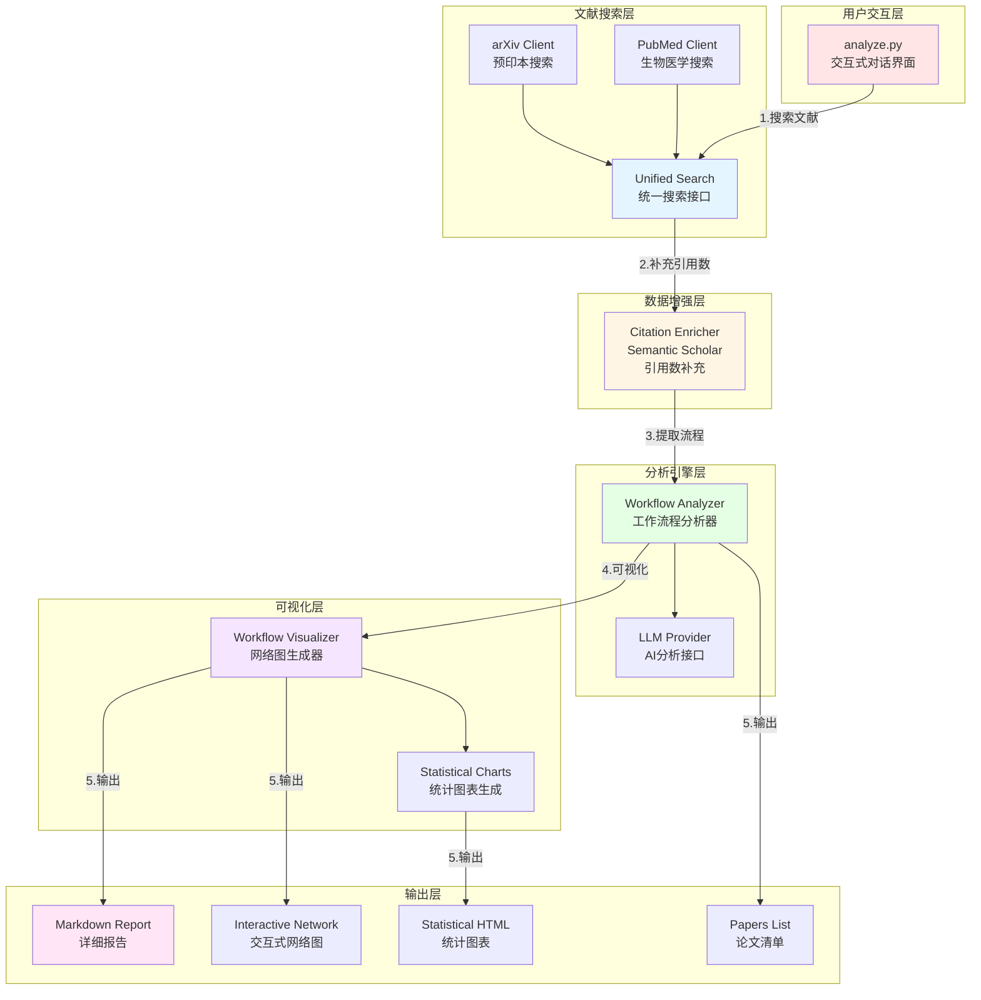
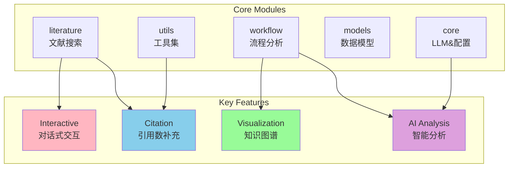
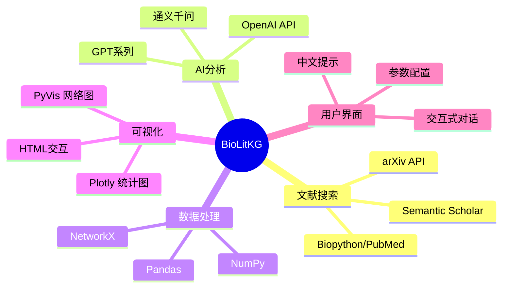
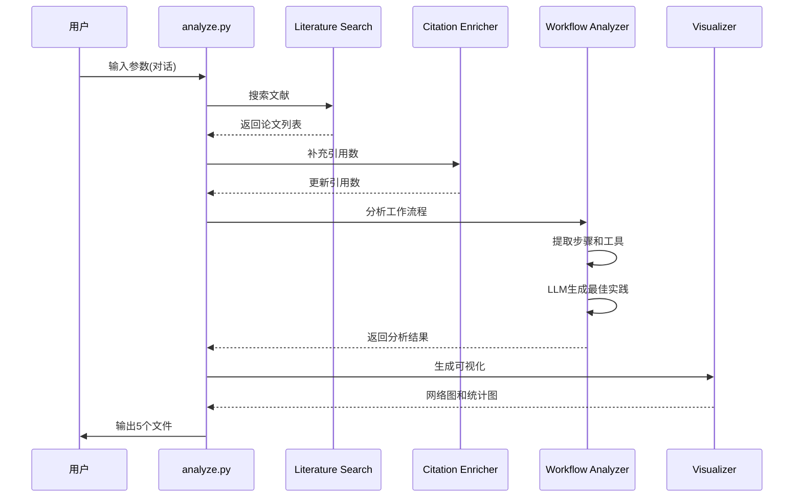

# BioLitKG 架构图

## 系统架构

---

## 数据流图

---

## 核心模块

---

## 技术栈

---

## 工作流程

---

## 使用这些图

### 公众号文章中
- 使用"系统架构图"展示整体设计
- 使用"数据流图"说明工作流程

### GitHub README中  
- 使用"核心模块图"
- 使用"技术栈图"

---

## PNG导出说明

使用在线工具将Mermaid图导出为PNG:
1. 访问: https://mermaid.live/
2. 粘贴对应的mermaid代码
3. 点击"Download PNG"
4. 用于公众号配图

或使用VSCode Mermaid插件直接导出。

