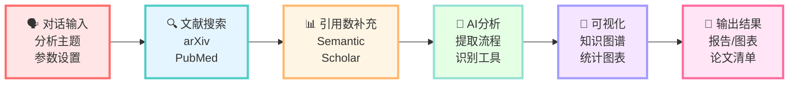
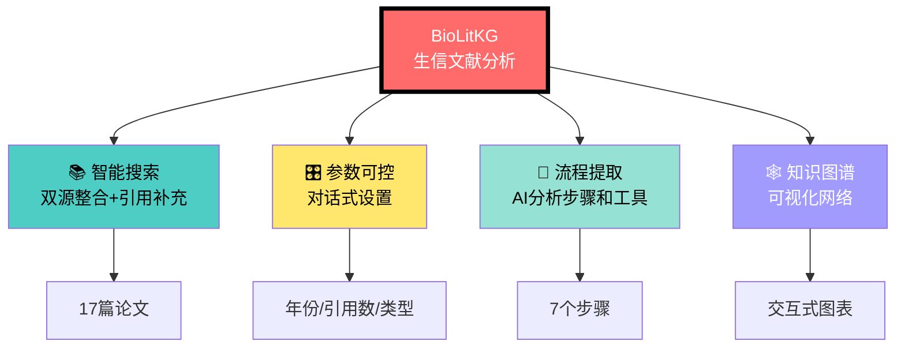
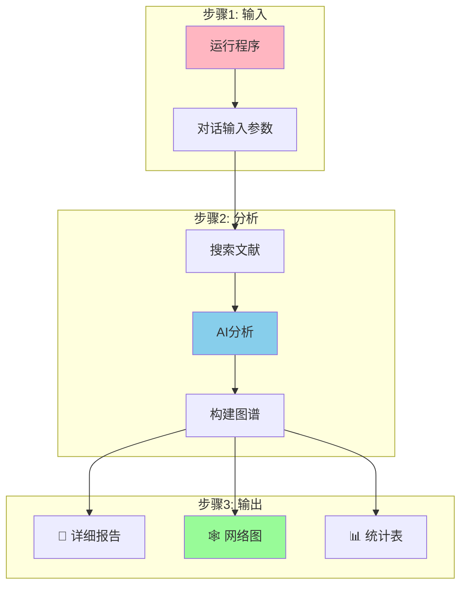

# 简化架构图 (适合公众号)

## 版本1: 横向流程图 (推荐用于公众号)



---

## 版本2: 核心功能图



---

## 版本3: 3步使用流程



---

## 版本4: 超简化(最适合公众号)


---

## 使用建议

### 公众号文章
推荐使用: **版本4 (超简化)** ⭐
- 最简洁
- 突出"3分钟"快速
- 流程清晰

### GitHub README
推荐使用: **版本1 (横向流程图)** ⭐
- 展示完整功能
- 技术细节清晰

---

## 导出步骤

### 在线导出
1. 访问 https://mermaid.live/
2. 粘贴对应版本的mermaid代码
3. 调整主题(可选):
   - Default (推荐)
   - Forest
   - Neutral
4. 点击 "Actions" → "PNG"
5. 下载图片

### 本地导出 (如果安装了mermaid-cli)
```bash
# 安装
npm install -g @mermaid-js/mermaid-cli

# 导出
mmdc -i 简化架构图.md -o architecture.png -t default -b white
```

---

## 配图文字建议

### 架构图配文
```
BioLitKG采用对话式交互,3分钟即可完成从文献搜索到知识图谱
可视化的全流程自动化分析。
```

### 强调重点
- 💬 **对话输入** - 无需编程
- ⚡ **3分钟** - 快速高效
- 📊 **可视化** - 直观美观
- 🆓 **开源** - 免费使用

---

**推荐使用版本4作为公众号主图!** 🎨

